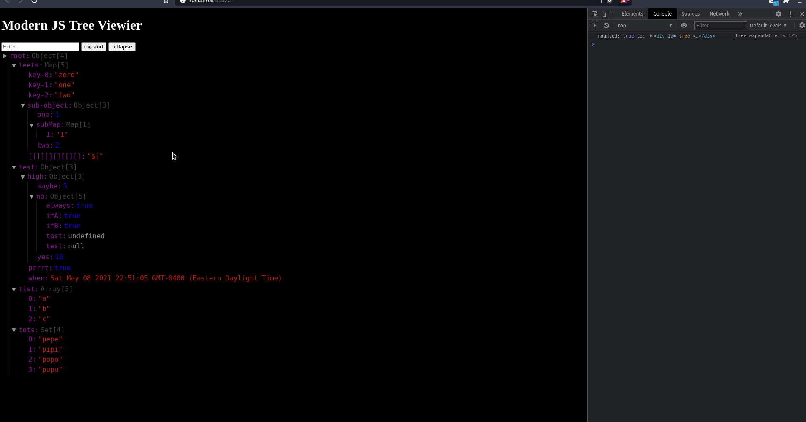

# Modern JS Tree Viewer <!-- omit in TOC -->

No depedency, javascript tree viewer that shows you basic data types, `Object`, `Array`, `Map`, and `Set`. I built this to be able to explore Maps and Sets that I use as state stores which are typically not supported by most state managers. [See example](example/) for basic usage.

> This library does not yet work with Functions, or DOM elements. If you keep it to the basic JSON data types + Map and Set, you should be OK.

- [Getting Started](#getting-started)
- [Usage](#usage)
  - [`treeView.toggle()`](#treeviewtoggle)
  - [`treeView.expandAll()`](#treeviewexpandall)
  - [`treeView.collapseAll()`](#treeviewcollapseall)
  - [`treeView.update(Map|Set|Array|Object)`](#treeviewupdatemapsetarrayobject)
  - [`treeView.search(string|RegExp)`](#treeviewsearchstringregexp)
- [Themes](#themes)
  - [Todos](#todos)



## Getting Started

```bash
npm i --save modern-js-tree
```

`index.js`

```js

const ModernJsTree = require('modern-js-tree');

const treeView = ModernJsTree({
    value: { /** value to inspect */ },
    mountTo: '#myElement', // optional
    theme: 'my-custom-theme' // optional
});
```

## Usage

### `treeView.toggle()`

Open and close the tree view.

### `treeView.expandAll()`

Expands all items in the tree

### `treeView.collapseAll()`

Collapse all items in the tree

### `treeView.update(Map|Set|Array|Object)`

Update the tree view with a new value.

### `treeView.search(string|RegExp)`

Filter through the items in the tree and display only things that match what you're searching for.

## Themes

Though the default theme will likely fit a light or dark container, you can customize the theme to your liking using the following css:

`my-custom-theme.css`

```css

.tree-view.my-custom-theme {
  font-family: monospace;
  font-size: 16px;
  line-height: 16px;
}

.tree-view.my-custom-theme .tree-view {
  border-left: 1px solid rgba(255, 255, 255, 0.1);
}

.tree-view.my-custom-theme .item:focus {
  border: 2px solid #424242;
}

.tree-view.my-custom-theme .spacer {
  height: 16px;
}

.tree-view.my-custom-theme .expand,

.tree-view.my-custom-theme .collapse {
  color: #969696;
}

.tree-view.my-custom-theme .expand:hover,

.tree-view.my-custom-theme .collapse:hover {
  background: rgba(255, 200, 200, 0.3);
}

.tree-view.my-custom-theme .name:hover, .tree-view.my-custom-theme .value:hover {
  background-color: rgba(0, 255, 255, 0.1);
}

.tree-view.my-custom-theme .name {
  color: #881391;
}

.tree-view.my-custom-theme .value.Boolean, .tree-view.my-custom-theme .value.Number {
  color: #1c00cf;
}

.tree-view.my-custom-theme .value.Object, .tree-view.my-custom-theme .value.Array, .tree-view.my-custom-theme .value.Map, .tree-view.my-custom-theme .value.Set {
  color: #424242;
}

.tree-view.my-custom-theme .value.undefined, .tree-view.my-custom-theme .value.null {
  color: #808080;
}

.tree-view.my-custom-theme .value.String, .tree-view.my-custom-theme .value.Date {
  color: #c41a16;
}
```

`my-custom-theme.scss`

```scss
$size: 16px;
$treeViewBorderLeft: 1px solid rgba(#fff, 0.1);
$itemBorderFocus: 2px solid #424242;
$actionColor: rgb(150, 150, 150);
$actionBgHover: rgba(255,200,200, 0.3);
$nameValueHover: rgba(aqua, 0.1);
$nameColor: rgb(136, 19, 145);
$boolNumColor: rgb(28, 0, 207);
$expandableColor: #424242;
$nullUndefinedColor: #808080;
$stringDateColor: #c41a16;

.tree-view.my-custom-theme {

    font-family: monospace;
    font-size: $size;
    line-height: $size;


    .tree-view {
        border-left: $treeViewBorderLeft;
    }

    .item:focus {
        border: $itemBorderFocus;
    }


    .spacer {
        height: $size;
    }


    .expand,
    .collapse {

        color: $actionColor;

        &:hover {

            background: $actionBgHover;
        }
    }


    .name, .value {

        &:hover {
            background-color: $nameValueHover;
        }
    }

    .name { color: $nameColor; }

    .value {


        &.Boolean,
        &.Number {

            color: $boolNumColor;
        }

        &.Object,
        &.Array,
        &.Map,
        &.Set {
            color: $expandableColor;
        }

        &.undefined,
        &.null {

            color: $nullUndefinedColor;
        }

        &.String,
        &.Date {
            color: $stringDateColor;
        }
    }

}
```


### Todos

- [ ] Write tests for current implementation
- [ ] Add support for functions and HTML elements
- [ ] Add support for misc classes
- [ ] Add ability to add, remove, rename, and change value of items in tree